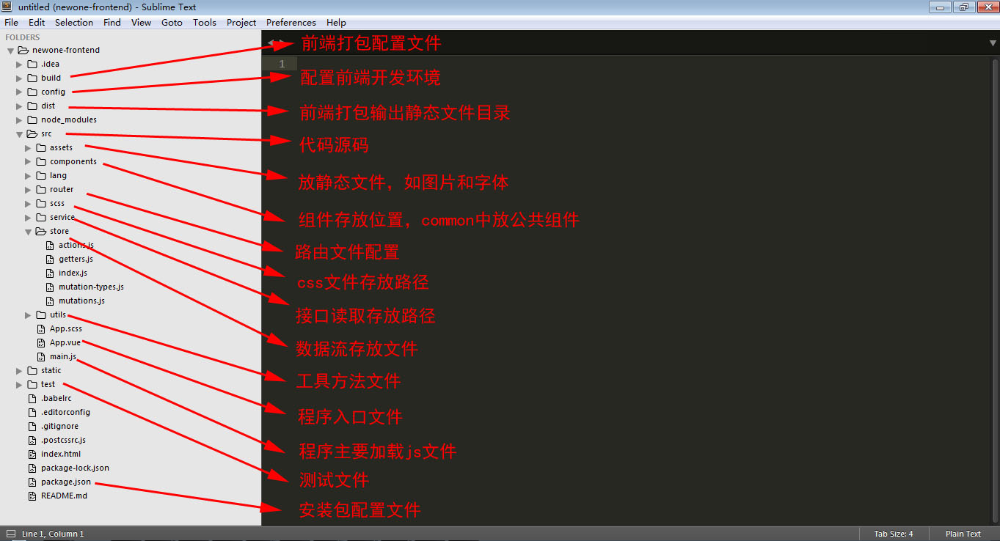

# newtouchOne主站前端

## 安装启动

``` sh
#安装
npm install

#开发启动
npm start

# 打包
npm run prod
```

###启动说明
- npm start 为开发环境，在浏览器中打开<http://localhost:5001>
- npm run prod 为生产环境，在浏览器中打开<http://localhost:8082>
- npm install安装失败可用cnpm install

###相关链接
* [vue]        <https://cn.vuejs.org/v2/guide/>
* [vue-router]<https://router.vuejs.org/zh-cn/index.html>
* [vuex]       <https://vuex.vuejs.org/zh-cn/intro.html>
* [iviewui]   <https://www.iviewui.com/components/grid>
* [webpack]   <https://webpack.js.org/concepts/>
* [ES6]        <http://www.ecma-international.org/ecma-262/6.0/>


###文件结构说明（fileStructure.jpg）



###代码规范
- [Javascript编码](javascript.md) 
- [CSS编码规范](css.md) 


